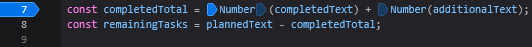
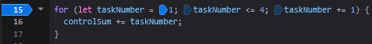

# Автор и вариант

Автор: Рупаков Павел
Группа: ЭФБО-03-25
Вариант: 3.

# Окружение

Операционная система: Windows 11 Home
Версия Node.js: v24.21.0
Версия npm: 11.19.0
Версия Git: 2.54.0.windows.1
Браузер: Firefox

# Запуск

node practice-01/js/hello.js
node practice-01/js/types.js
node practice-01/js/progress.js
node practice-01/js/progress-input.js
node practice-01/js/plan.js
node practice-01/js/debug.js

# Задание 1

1. Файл запущен через node practice-01/js/hello.js
Вывод появился в терминале, результат последней строки: undefined.
2. Файл запущен через index.html
Вывод появился в консоли в инструментах разработчика, результат последней строки: object.

В браузере объект document встроен по умолчанию и отвечает за работу с HTML-страницей (DOM), поэтому его тип — object. В среде Node.js интерфейса веб-страниц нет, и объект document отсутствует, поэтому его тип — undefined.

# Задание 2

|Выражение | Ожидание до запуска|Фактическое значение|Тип результата |Объяснение |
| --- | --- | --- | --- | --- |
|"8" + 2|82|82|string|Конкатенация|
| --- | --- | --- | --- | --- |
|"8" - 2|6|6|number|Математическое вычитание, т.к. строки вычитать нельзя|
| --- | --- | --- | --- | --- |
|Number("8") + 2|10|10|number|Явное приведение строки к числу|
| --- | --- | --- | --- | --- |
|"12" > "3"|false|false|boolean|Посимвольное сравнение: 1 < 3|
| --- | --- | --- | --- | --- |
|12 === "12"|false|false|boolean|Строгое равенство, сравниваются значения и типы данных|
| --- | --- | --- | --- | --- |
|Number("")|0|0|number|Пустая строка при приведении превращается в ноль|
| --- | --- | --- | --- | --- |
|Number("text")|NaN|NaN|number|Обычный текст нельзя превратить в число|
| --- | --- | --- | --- | --- |
|Boolean("false")|true|true|boolean|Любая непустая строка возвращает true|
| --- | --- | --- | --- | --- |
|typeof null|object|object|string|Следствие старого бага, где typeof null возвращает object, а typeof "object" = string|
| --- | --- | --- | --- | --- |
|"typeof NaN|number|number|string|Расшифровывается как не число, принадлежит к числовому типу данных, typeof "number" дает string|
| --- | --- | --- | --- | --- |
# Задание 3

|Проверка         |Входные данные|Ожидаемый результат|Фактический результат|Итог|
|-----------------|--------------|-------------------|---------------------|-----|
|Обычный случай   |12 5|Осталось 7; прогресс 41.7%; статус «В работе».|Осталось 7; прогресс 41.7%; статус «В работе».|Пройдено|
|-----------------|--------------|-------------------|---------------------|---|
|Граничный случай |5 5|Осталось 0; прогресс 100.0%; статус «Завершено».|Осталось 0; прогресс 100.0%; статус «Завершено».|Пройдено|
|-----------------|--------------|-------------------|---------------------|---|
|Некорректные данные|5 6|Ошибка: выполнено больше, чем существует.|Ошибка: выполнено больше, чем существует.|Пройдено|
|-----------------|--------------|-------------------|---------------------|---|

# Задание 4

|Проверка         |Входные данные|Ожидаемый результат|Фактический результат|Итог|
|-----------------|--------------|-------------------|---------------------|-----|
|Обычный случай   |12 5 3|3 дня; в последний день выполнена 1 задача.|3 дня; в последний день выполнена 1 задача.|Пройдено|
|-----------------|--------------|-------------------|---------------------|---|
|Граничный случай |5 3 3|1 день, выполнено только 2 оставшиеся задачи.|1 день, выполнено только 2 оставшиеся задачи.|Пройдено|
|-----------------|--------------|-------------------|---------------------|---|
|Некорректные данные|12 6 1.3|Ошибка: дробной дневной нормы быть не должно.|Ошибка: дробной дневной нормы быть не должно.|Пройдено|
|-----------------|--------------|-------------------|---------------------|---|

# Задание 5 / Отладка

Исходный результат:
Строка 7: const completedTotal = completedText + additionalText;
Cтрока 15: for (let taskNumber = 1; taskNumber < 4; taskNumber += 1)

Исправленный результат:
Строка 7: const completedTotal = Number(completedText) + Number(additionalText);
Cтрока 15: for (let taskNumber = 1; taskNumber <= 4; taskNumber += 1)

Причины ошибок:
1. Вместо сложения чисел проходила **конкатенация** строк
2. 4 не входила в границы цикла, из за чего последнее сложение не проходило.

Точки остановы:

# Расширение

|Проверка         |Входные данные|Ожидаемый результат|Фактический результат|Итог|
|-----------------|--------------|-------------------|---------------------|-----|
|Обычный случай   |"9" "3"|Осталось 6; прогресс 33.3%; статус «В работе».|Осталось 6; прогресс 33.3%; статус «В работе».|Пройдено|
|-----------------|--------------|-------------------|---------------------|---|
|Граничный случай |"12" "12"|Осталось 0; прогресс 100.0%; статус «Завершено».|Осталось 0; прогресс 100.0%; статус «Завершено».|Пройдено|
|-----------------|--------------|-------------------|---------------------|---|
|Некорректные данные|5 6|Ошибка: входные данные должны быть строками.|Ошибка: входные данные должны быть строками.|Пройдено|
|-----------------|--------------|-------------------|---------------------|---|

# Вывод

В ходе выполнения практической работы № 1 были успешно освоены базовые этапы разработки и отладки программ на языке JavaScript, а также подготовка локального рабочего окружения.

## Основные результаты:
**Изучены среды выполнения:** На практике исследованы различия между браузерным окружением (где доступен объект `document` для работы с DOM) и серверной платформой Node.js (где `document` возвращает `undefined`).
**Освоена работа с типами данных и валидацией:** Разработаны алгоритмы проверки входных данных (с использованием методов `Number.isInteger()` и `Number.isFinite()`), учитывающие граничные условия, обработку пустых строк и защиту от деления на ноль. 
**Закреплены управляющие конструкции:** Написана логика расчета прогресса выполнения задач с помощью разветвленных условий (`if-else if`), а также пошаговое планирование распределения нагрузки с использованием цикла `while` и встроенной функции `Math.min()`.
**Применены навыки отладки:** На примере файла `debug.js` освоена пошаговая отладка кода (`Step over`) с использованием точек останова (`Breakpoints`) и панелей отслеживания переменных (`Scope`) в инструментах разработчика Firefox/Chromium.

### Наиболее показательная ошибка:
Самой показательной ошибкой в работе стала **неявная конкатенация строк при использовании оператора `+`**. При попытке сложить текстовое значение числа (например, `"8" + 2`) JavaScript не выдает ошибку, а автоматически приводит число к строке и склеивает их, возвращая `"82"` вместо математической суммы `10`. Это наглядно доказало необходимость обязательного явного приведения типов с помощью функции `Number()` при обработке любых внешних данных, а также важность использования строгого равенства (`===`) для предотвращения скрытых багов в логике программы.
